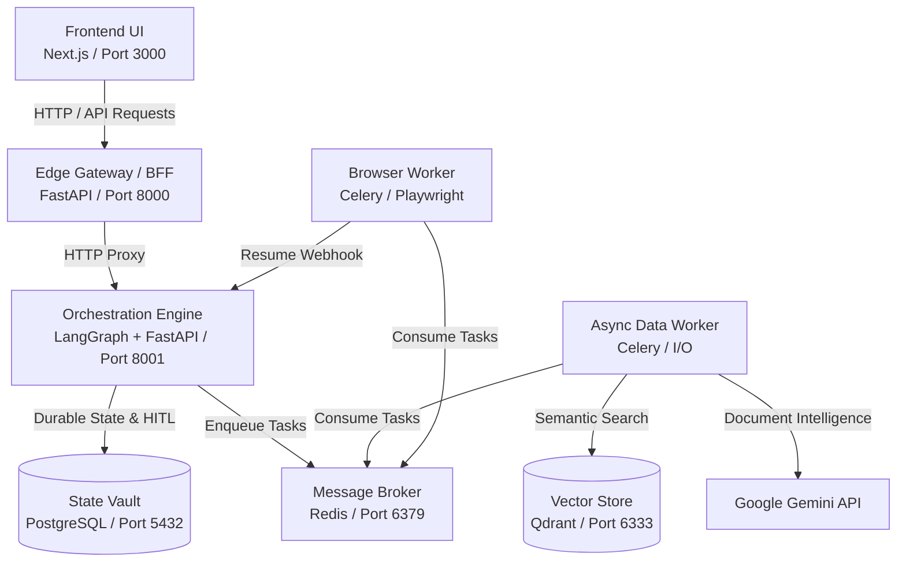

# CV Matcher & Automated Application Agent

A full-stack, AI-driven automation system designed to ingest your CV, find matching job descriptions, and automatically navigate platforms like Workday and Greenhouse to apply on your behalf. 

Powered by **Google Gemini 2.5 Flash** for document intelligence, **Playwright / browser-use** for browser automation, and **LangGraph** for cognitive orchestration.

---

## 🏗️ The 7-Container Architecture

This project is built on a highly decoupled, production-grade microservices architecture orchestrated by `docker-compose` to ensure robust resource isolation, mitigating memory leaks and system crashes common to headless browser environments.

### System Architecture Diagram



### Component Details

| Container | Tech Stack | Architecture Pattern / Role |
| :--- | :--- | :--- |
| **1. Edge Gateway / BFF** | Python (FastAPI) | **The Ambassador.** Serves as the sole public entry point. Manages auth, rate limiting, and aggregates data for the Next.js client. |
| **2. Orchestration Engine** | LangGraph + FastAPI | **The Control Plane.** Manages graph state, makes cognitive decisions, evaluates CV data via Gemini APIs, and dispatches instructions. |
| **3. Message Broker** | Redis | **The Nervous System.** Manages task queues, providing asynchronous decoupling between cognitive decision and mechanical action. |
| **4. Async Data Worker** | Celery (Threaded Pool) | **The I/O Processor.** Dedicated to lightweight async tasks: polling job boards, extracting data with Gemini, and embedding vectors. |
| **5. Autonomous Browser Worker**| Celery (Solo Pool) + Playwright | **The Execution Plane.** Executes heavy DOM manipulation. Uses the "Death Pact" config (`--max-tasks-per-child`) for pure memory isolation. |
| **6. Relational State Vault** | PostgreSQL | **Durable Memory.** Stores structured user data, CV profiles, and LangGraph checkpointing states for Human-in-the-Loop (HITL) pauses. |
| **7. Semantic Vector Store** | Qdrant | **The Matchmaker Core.** Manages high-dimensional embeddings to execute cosine similarity searches between CVs and Jobs. |

*(Note: The system also includes an 8th container for the **Frontend UI** built with Next.js/React).*

---

## 🛠️ Useful Commands & Scripts

Here are the essential commands for running, testing, and debugging the system.

### 1. Stack Management

- **Start all services (interactive mode):**
  ```bash
  docker compose up --build
  ```
- **Start all services in background (detached mode):**
  ```bash
  docker compose up -d --build
  ```
- **Stop all services:**
  ```bash
  docker compose down
  ```
- **Stop and remove all volumes (nuclear reset for databases & caches):**
  ```bash
  docker compose down -v
  ```

### 2. Running Tests

- **Run all integration and unit tests:**
  ```bash
  docker compose up --build test-runner
  ```
  *(This will compile the containers, wait for health checks, run `pytest -v tests`, and exit).*
  
- **Run tests and automatically stop/cleanup containers on exit:**
  ```bash
  docker compose up --build --abort-on-container-exit --exit-code-from test-runner test-runner
  ```

### 3. Monitoring & Debugging

- **Inspect Docker logs in real time:**
  ```bash
  docker compose logs -f <service-name>
  # Examples:
  docker compose logs -f bff-gateway
  docker compose logs -f worker-browser-heavy
  ```
- **Check Celery worker status & active tasks:**
  ```bash
  # Check active workers
  docker exec -it cv_worker_data celery -A tasks_api status
  # Inspect active running tasks
  docker exec -it cv_worker_data celery -A tasks_api inspect active
  ```
- **Inspect PostgreSQL state tables directly:**
  ```bash
  docker exec -it cv_postgres_state psql -U user -d cv_state -c "\dt"
  ```
- **Interact with Redis CLI:**
  ```bash
  docker exec -it cv_redis redis-cli monitor
  ```

### 4. Direct UI & Swagger Access Points

Once the stack is running, you can access the following services directly from your host machine:

- **Frontend UI Dashboard**: [http://localhost:3000](http://localhost:3000)
- **Edge Gateway (BFF) API Docs**: [http://localhost:8000/docs](http://localhost:8000/docs)
- **Orchestration Engine API Docs**: [http://localhost:8001/docs](http://localhost:8001/docs)
- **Qdrant Vector Database Dashboard**: [http://localhost:6333/dashboard](http://localhost:6333/dashboard)

---

## Current Implementation Notes

This section records the current live setup so future changes stay aligned with the repository state.

| Area | Current State | Notes |
| :--- | :--- | :--- |
| **Database persistence** | Docker-managed named volume | `state-vault` uses the `pg_state_data` volume mounted at `/var/lib/postgresql/data`. The repo-local `data/postgres/` folder is not used. |
| **Orchestration startup** | Autocommit enabled | `orchestration-engine/main.py` creates the `ConnectionPool` with `autocommit=True` so `langgraph-checkpoint-postgres` can run setup without transaction errors. |
| **Testing** | Dynamic mock registration | All unit tests register their dynamic modules in `sys.modules` during imports, ensuring `@patch` decorators can resolve target namespaces during test runs. |
| **Service map** | 7 product containers + 1 UI container + 1 test runner | The product stack is the 7 core containers described above, plus the Frontend UI. The test runner is used for automated validation. |

---

## 🗂️ File Structure

The workspace strictly enforces separation of concerns:

```text
/ (Root)
│
├── docker-compose.yml           <-- Master orchestration for the distributed system
├── README.md                    <-- Project documentation
├── requirements-test.txt        <-- Dependencies for testing
├── pytest.ini                   <-- Pytest settings
│
├── bff-gateway/                 <-- Edge Gateway (BFF)
│   ├── Dockerfile               <-- Multi-stage build for routing & auth
│   └── main.py                  
│
├── orchestration-engine/        <-- LangGraph Control Plane
│   ├── Dockerfile               
│   ├── graph.py                 <-- LangGraph workflow nodes/edges definitions
│   ├── state.py                 <-- Pydantic schemas & state variables
│   └── main.py                  
│
├── worker-data-io/              <-- Async I/O Data Worker
│   ├── Dockerfile               
│   └── tasks_api.py             <-- Job parsing, Gemini extraction, Embeddings
│
├── worker-browser-heavy/        <-- Playwright Browser automation Worker
│   ├── Dockerfile               <-- Bundles Playwright, chromium, and system deps
│   └── tasks_browser.py         <-- Solo pool browser-use automation logic
│
├── frontend-ui/                 <-- Next.js Frontend Presentation Layer
│   ├── Dockerfile           
│   ├── package.json         
│   └── src/                 
│
├── scripts/                     
│   └── wait_for_services.py     <-- Verification script checking TCP port availability
│
└── tests/                       <-- Automated testing suite
    ├── test_bff_gateway.py
    ├── test_orchestration_engine.py
    ├── test_worker_browser_heavy.py
    └── test_worker_data_io.py
```

---

## 🚀 System Data Flow & State Management

**1. Initiation:** The frontend UI requests an application blitz through the BFF Gateway.
**2. Decision (Orchestration):** LangGraph processes the user's CV via the `worker-data-io` container and matches profiles across embeddings stored in Qdrant.
**3. Execution (Playwright):** Relevant jobs are enqueued to Redis, consumed by the `worker-browser-heavy` containers. Utilizing isolated ephemeral browser contexts, it performs complex DOM manipulations.
**4. Human-In-The-Loop (HITL):** At the final verification step on platforms like Workday, Playwright pauses. The Orchestration engine serializes its state directly into PostgreSQL (`langgraph-checkpoint-postgres`).
**5. Resumption:** Once the user reviews and clicks "Approve", the state is deserialized, signaling the pending Playwright worker via webhook to confirm and complete the application.
